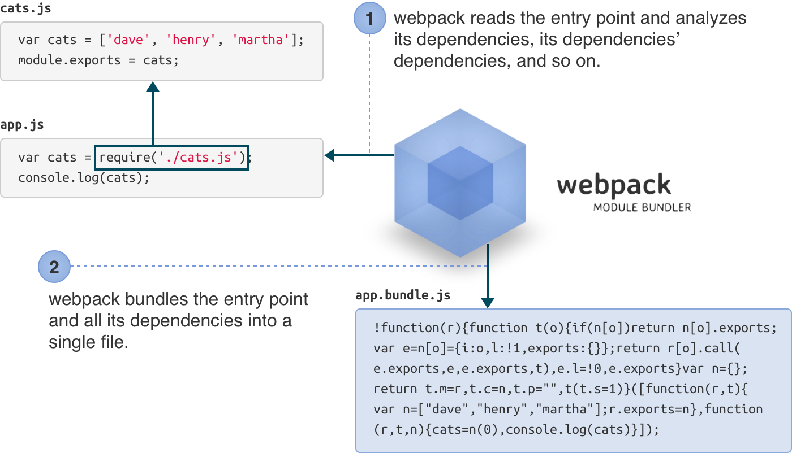

# Webpack 2 Configuration

---

## What is Webpack?


---

## How It Works?

```bash
webpack src/app.js build/app.bundle.js
```



---

## What's new in Webpack 2

* Support ES6 modules           <!-- .element: class="fragment" -->
* Tree shaking                  <!-- .element: class="fragment" -->
* Environment profiles          <!-- .element: class="fragment" -->
* Enhanced resolver             <!-- .element: class="fragment" -->

---

## Project structure

* src/                <!-- .element: class="fragment" -->
* build/              <!-- .element: class="fragment" -->
* node_modules/       <!-- .element: class="fragment" -->
* webpack.config.js   <!-- .element: class="fragment" -->

---

## The simplest configuration

```JavaScript
// webpack.config.js
module.exports = {
  entry: './src/app.js',
  output: {
    path: __dirname + '/build',
    filename: 'bundle.js'
  }
};
```

```bash
webpack
```

---

## Webpack-validator

```bash
npm install -D webpack-validator
node_modules/.bin/webpack-validator webpack.config.js
```

---

## Development Mode

```bash
webpack -d --watch

#  -d is the short-hand for
#    --debug 
#    --devtool eval-cheap-module-source-map
#    --output-pathinfo         
```

---

## Enable source map
```JavaScript
// webpack.config.js
module.exports = {
  entry: './src/app.js',
  output: {
    path: __dirname + '/build',
    filename: 'app.bundle.js'
  },
  devtool: 'eval-source-map'
};
```

---

## Webpack Dev Server
```bash
npm install -D webpack-dev-server
node_modules/.bin/webpack-dev-server
```

---

## Webpack Dev Server configuration
```JavaScript
// webpack.config.js
module.exports = {
  entry: './src/app.js',
  output: {
    path: __dirname + '/build',
    filename: 'app.bundle.js'
  },
  devtool: 'eval-source-map',
  devServer: {
    contentBase: __dirname + '/build',
    port: 8000,
    open: true,
    compress: true,
    stats: 'errors-only'
  }
};
```

---

## Creating a mock API
```JavaScript
npm install -D npm-run-parallel
npm install -D json-server
```

```JavaScript
// package.json
...
  "scripts" : {
    "dev:server" : "webpack-dev-server",
    "dev:api" : "json-server ./src/db.json",
    "dev" : "npm-run-parallel dev:server dev:api"
  }
...
```

---

## HTML Webpack Plugin

Basic configuration
```bash
npm install -D html-webpack-plugin
```

```JavaScript
//webpack.config.js
var HtmlWebpackPlugin = require('html-webpack-plugin');
module.exports = {
  entry: './src/app.js',
  output: {
    path: __dirname + '/build',
    filename: 'app.bundle.js'
  },
  plugins: [new HtmlWebpackPlugin()]
};

```

---

## HTML Webpack Plugin

Custom template
```JavaScript
//webpack.config.js
var HtmlWebpackPlugin = require('html-webpack-plugin');
module.exports = {
  entry: './src/app.js',
  output: {
    path: __dirname + '/build',
    filename: 'app.bundle.js'
  },
  plugins: [
    new HtmlWebpackPlugin({
      title: 'My Demo App',
      template: __dirname + '/src/index.ejs',
      filename: __dirname + '/build/index.html'
    })
  ]
};

```

---

## Environment Settings

```JavaScript
//webpack.config.js
modules.exports = (env) => {
  return {
    entry: './src/app.js',
    output: {
      path: __dirname + '/build',
      filename: 'app.bundle.js'
    },
    devtool: env.dev ? 'eval-source-map' : ''
  }
}
```

```bash
webpack --env.dev
```

---

## Tree Shaking

```JavaScript
// .babelrc

-  "presets": ["es2015", ...]
+  "presets": ["es2015-webpack", ...]

```

```bash
npm isntall -D babel-preset-es2015-webpack
webpack -p

```

---

## Multiple Entries
```JavaScript
//webpack.config.js
...
    entry: {
      app: './src/app.js',
      contact: './src/contact.js'
    },
    output: {
      path: __dirname + '/build',
      filename: '[name].bundle.js'
    },
...
```

---

## Long-term caching

---

## Separate common modules and third-party libraries

---

## Lazy-loading ES6 modules

---

## CSS-loader and Style-loader
```bash
npm install -D css-loader style-loader
```

```JavaScript
//webpack.config.js
...
    module: {
      loaders: [
        {test: /\.css$/, loader: 'style-loader!css-loader'}
      ]
    }
...
```

```JavaScript
//app.js
import './style.css';
```

---

## Sass-loader
```bash
npm install -D sass-loader
```

```JavaScript
//webpack.config.js
...
    module: {
      loaders: [
        {test: /\.css$/, loader: 'style-loader!css-loader'},
        {test: /\.scss$/, loader: 'style-loader!css-loader!sass-loader'}
      ]
    }
...
```

```JavaScript
//app.js
import './style.scss';
```

---

## Extract inline CSS to external file
```
npm install -D extract-text-webpack-plugin@2.1
```

---